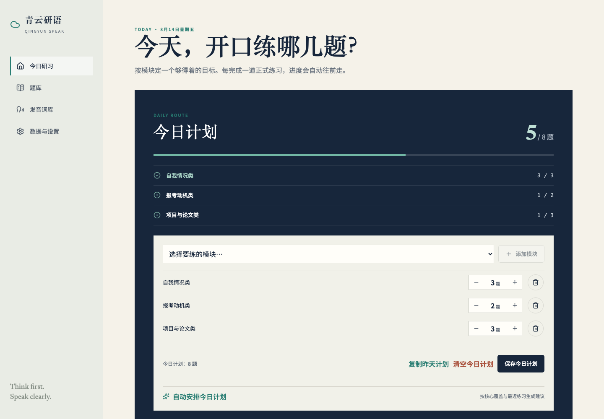
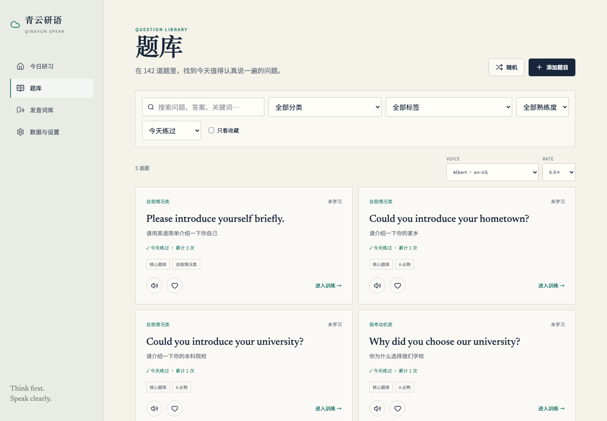
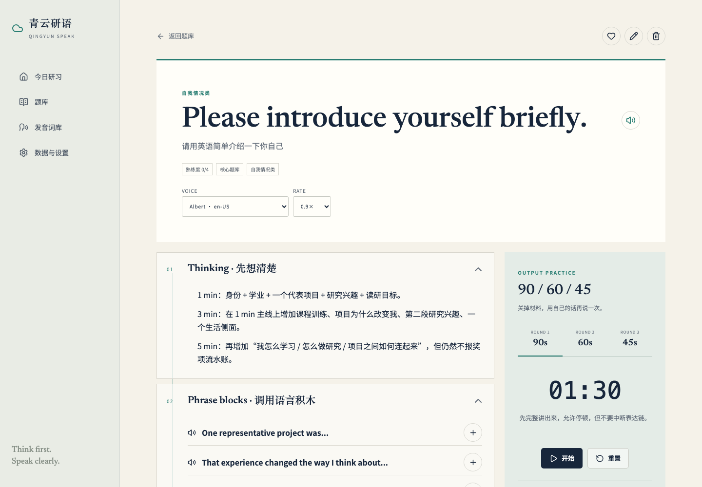

# 青云研语 · Qingyun Speak

  <strong>为保研复试与研究生英语面试准备的个人口语训练桌</strong> 
  先想清楚，再用短句把观点稳稳说出来。

  <a href="https://lipume.github.io/qingyun-speak/"><strong>打开青云研语 →</strong></a>

## 不再面对一百多道题发愁

青云研语把英语面试准备拆成一条每天都能完成的训练路径：

1. 按模块设定今天要练几题；
2. 优先覆盖从未正式开口练过的核心题；
3. 借助 Thinking 和 Phrase Blocks 组织思路；
4. 关掉材料，完成 90 / 60 / 45 秒输出；
5. 手动打卡，留下真实的练习记录。

这里不会把“看过答案”“听过朗读”和“真正开口练过”混在一起。只有主动点击 **完成练习**，才会计入覆盖进度与连续练习天数。

## 每天打开，马上知道练什么

- **今日计划**：为自我情况、报考动机、项目与论文等模块分别设定目标题数。
- **自动推荐**：优先安排未练核心题、久未复习题，再补充同模块与扩展题。
- **实时进度**：练同模块中的任意题，都会自动更新该模块完成度。
- **核心题覆盖**：清楚看到哪些高频题已经正式练过，哪些仍未开口。
- **练习历史**：保留每次打卡时间、累计次数、最近 30 天记录与连续练习天数。

## 题库不是清单，而是训练入口

内置 142 道英语复试与研究生面试问题，覆盖个人背景、报考动机、科研项目、课程学习、压力面试、未来规划与观点分析等主题。

你可以按分类、标签、收藏、熟练度和练习状态组合筛选，也可以直接查看：

- 未练；
- 已练；
- 今天练过；
- 核心题库；
- 需要继续巩固的模块。

练习次数与主观熟练度彼此独立。练得多不代表已经掌握，熟练度仍由你根据真实表现调整。

## 从思路到开口，完成一轮正式输出

每道题围绕真实输出组织，而不是要求逐字背稿：

- **Thinking**：先确定观点、理由和个人经历；
- **Phrase Blocks**：调用可复用的英语表达积木；
- **Spoken Answer**：按句听示范，理解完整表达如何拼装；
- **Fallback Expressions**：忘词时换成更简单的说法，保持表达链路不断；
- **90 / 60 / 45**：从完整输出，到压缩重点，再到重新组织；
- **完成练习**：记录本次正式开口，并支持短时间撤销。

英文问题、短语、单句和完整回答都可以直接朗读，语速可调，不需要额外音频文件。

## 你的数据，只留在你的浏览器

> **正常关闭网页、退出浏览器或重启电脑，数据不会消失。**

青云研语不要求注册账号，也不需要 API Key。你修改过的题目、收藏、熟练度、每日计划和每次练习打卡，都保存在当前浏览器为青云研语分配的 `localStorage` 中。

这些数据属于“当前设备 + 当前浏览器 + 当前浏览器用户 + 当前网站地址”。它们不会自动上传到 GitHub，也不会在不同电脑或不同浏览器之间同步。

### 分别保存了什么

| 数据 | 保存内容 | 浏览器存储项 |
| --- | --- | --- |
| 题库数据 | 修改后的题目、收藏、熟练度、发音词库 | `qingyun.dataset.v1` |
| 练习历史 | 每次点击“完成练习”的题目与时间；累计次数、最近练习和连续天数由此计算 | `qingyun.training.v1` |
| 每日计划 | 每天选择的模块、目标题数和历史计划 | `qingyun.daily-plan.v1` |
| 使用设置 | 朗读语速、语音选择等偏好 | `qingyun.settings.v1` |

### 哪些操作不会清除数据

- 关闭当前网页或浏览器；
- 关闭电脑后重新打开；
- 刷新网页；
- 网站发布新版本；
- 恢复默认题库——只恢复题目，不会清除练习历史与每日计划。

### 哪些情况可能导致数据丢失

- 清除浏览器中青云研语的网站数据或全部浏览数据；
- 使用无痕 / 隐私模式，并在关闭窗口后继续依赖其中的数据；
- 更换电脑、浏览器或浏览器用户；
- 重装或重置浏览器；
- 主动点击“清空练习历史”或“清空每日计划”。

因此，浏览器存储适合个人日常使用，但不能代替长期备份。

### 建议定期导出完整备份

你可以随时：

- 导出完整训练备份；
- 恢复题库、练习历史、每日计划和设置；
- 单独清空练习历史或每日计划；
- 保留训练记录，同时恢复默认题库。

完整备份包含题库、练习历史、每日计划和设置。建议每隔一段时间导出一次；更换浏览器、换电脑或清理浏览器数据前，也请先保存一份。之后可以在“数据与设置”页面恢复。

## 现在开始

无需安装，使用现代版 Chrome、Edge 或 Safari 直接打开：

**[https://lipume.github.io/qingyun-speak/](https://lipume.github.io/qingyun-speak/)**

> 截图中的计划与练习记录为演示数据。
